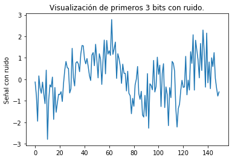
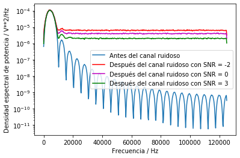

# Tarea 4 - MPSS - Elena Villalobos Herra - B78335
___
## 1. Crear un esquema de modulación BPSK para los bits presentados. Esto implica asignar una forma de onda sinusoidal normalizada (amplitud unitaria) para cada bit y luego una concatenación de todas estas formas de onda.

Para crear el esquema de modulación deseado, lo que se hizo es lo siguiente: Primero, se define una onda seno con la frecuencia solicitada (5 kHz). Después, con un for en python se va creando la señal completa: cada bit es un periodo de la onda. Si se tiene un 1 la señal será seno y si se tiene un 0 la señal será -seno. Para revisar la onda creada, se muestran la correspondiente a los primeros tres bits modulados en la siguiente imagen:

Los primeros bits del archivo en efecto son 0, 1, 0; por lo que la imagen tiene -seno, seno y -seno. Esto muestra que ya se tiene completo el esquema de modulación BPSK deseado.

## 2. Calcular la potencia promedio de la señal modulada generada.

Este cálculo se genera muy fácilmente en el código. La potencia instantánea de la señal es sumamente fácil de calcular teniendo en cuenta lo siguiente analizado en clases:

    

 

    

En Python, este cálculo se llevó a cabo gracias a la función de scipy integrate.trapz, y el resultado obtenido es de 0,49. 

## 3. Simular un canal ruidoso del tipo AWGN (ruido aditivo blanco gaussiano) con una relación señal a ruido (SNR) desde -2 hasta 3 dB.
En clases se explicó que la señal a ruido se define del siguiente modo:

    

Ps es la potencia de la señal (que recién se calculó en la parte 2 de la tarea), y Pn es la potencia del ruido. Considerando esto, es posible despejar Pn; pues ya se tienen todos los demás datos. 
Ya con la potencia del ruido definida, se calcula el ruido con np.random.normal; y se suma este ruido directamente a la señal con los bits. 

Con un for en Python, se van graficando las señales con los distintos niveles de ruido. Por ejemplo, cuando SNR = -2 los primeros tres bits se observan como en la siguiente imagen:

Con el ruido, la señal es muy difícil de identificar para una persona; se verá más adelante cómo decodificar esta señal.

Se muestran el resto de gráficas con los distintos SNR solicitados:

Para SNR = -1:

Para SNR = 0:

Para SNR = 1:

Para SNR = 2:

Para SNR = 3:

## 4. Graficar la densidad espectral de potencia de la señal con el método de Welch (SciPy), antes y después del canal ruidoso.

Esta gráfica se puede hacer para los distintos niveles de SNR, pero como el resultado es muy similar, se muestra cuando SNR = -2, SNR= 0 y SNR = 3.

Como se observa, antes del ruido la señal tiene potencia principalmente en los 5 kHz (que es la frecuencia deseada), y posteriormente la potencia que contienen otras componentes de frecuencia disminuye considerablemente. Existen varios "brincos" en la forma de esta densidad de potencia, pero se debe recordar que se está creando una onda sinusoidal con tan solo 50 puntos por periodo; provocando ruido en altas frecuencias. A pesar de esto, se observa la tendencia de un pico en la frecuencia deseada y un decrecimiento de potencia conforma se avanza en el eje de la frecuencia.

Con respecto a la señal después del ruido, sigue teniendo la potencia principalmente en 5 kHz, pero como se le introdujo ruido blanco gaussiano, ahora tiene mucho ruido en altas frecuencias; y este no decrece conforme se aumenta la frecuencia, sino que se mantiene relativamente constante. Algo interesante de observar es que conforme aumenta el SNR, disminuye la magnitud de ruido, como se observa en la imagen.

## 5. Demodular y decodificar la señal y hacer un conteo de la tasa de error de bits (BER, bit error rate) para cada nivel SNR.

Para conseguir esto, se hace una decodificación de la señal por detección de energía. Se toma un periodo de la onda y se multiplica por un periodo de la onda seno, esto es análogo a elevar al cuadrado la señal original para obtener su potencia instantánea. Como lo que se tiene en la señal son ondas seno y menos seno, si se trata de un bit que es 1 se esperaría obtener un resultado positivo; pues se estáría multiplicando seno por seno. En el caso contrario, si se trata de un bit que es 0 se eséraría obtener el mismo número del caso contrario pero negativo; pues lo que se estaría multiplicando se puede ver así: -(seno*seno). 
En resumen, se obtendría un valor A si el bit que se recibe es 1 y un valor -A si el bit que se recibe es 0. Por esto, se compara la multiplicación de la señal recibida con cero; si el resultado obtenido es positivo se concluye que se tiene un bit 1 y si es negativo se concluye que es un bit 0. 

El comparar con 0 dio un resultado excelente, y se encontró que la tasa de error de bits fue 0 sin para todos los SNR probados: 

## 6.  Graficar BER versus SNR.

Como se observó en el punto anterior, para todos los SNR probados la tasa de errores de bits se mantuvo en cero; esto demuestra un excelente proceso de decodificación:

Para lograr observar cuándo la decodificación empesaría a fallar, se hizo una prueba extra donde se probaron valores más negativos de SNR, pues como se vio en el punto 4, valores más negativos hacen que el ruido cobre más fuerza. 

 

Ya para valores de SNR menores a -4, se empiezan a encontrar errores en la decodificación, y cuando se llega a -8 los errores aumentan considerablemente.
